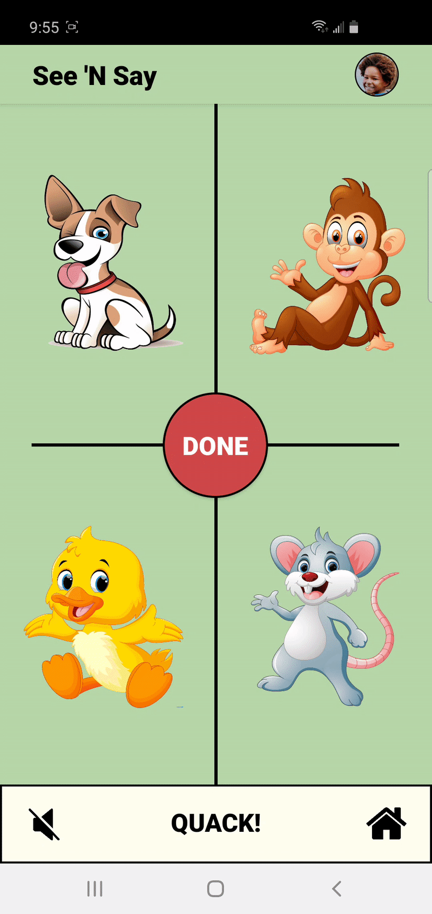
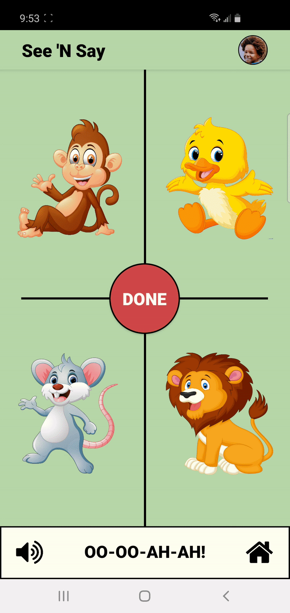

<h1 align="center">
  

See 'N Say Children's App

</h1>

<h4 align="center">
  Mobile app made for children to challenge their ability to match animal sounds to the correct animal. I designed and wrote this app for the final project of my Native Mobile Applications course. 
</h4>
 

## :warning: Notice

All the resources and assets used in the app are not my property. All resources/assets are from flaticon, google images, youtube, etc. The rights are reserved to the designer of each resource. If you have any problem with me using your resources, please contact me. Thanks!

## :eyes: Visuals

  
  
  

## :exclamation: About

See 'N Say is a native Android app developed in Java on Android Studio. Its objective is to entertain children while helping them develop their cognitive skills. The app includes a photo feature, allowing the child to take a picture before each round, designed to heighten the ending affirmation and increase the feeling of personal acheivement.

## :rocket: Technologies

This project was developed with the following technologies:

- Java
- XML
- Camera API
- Android Studio

## :running: Running

Please download the files and open the project in [Android Studio](https://developer.android.com/studio). The project requires a minimum SDK of 26 or higher.

### Important

The development process was only created for and tested on phones in portrait orientation, so I can't guarantee proper behavior on tablets, wearables, tv's, etc. But feel free to try it yourself.

---

Made with ♥ by Zeek Collins :wave: [Get in touch!](https://www.linkedin.com/in/ezekialcollinsii/)
